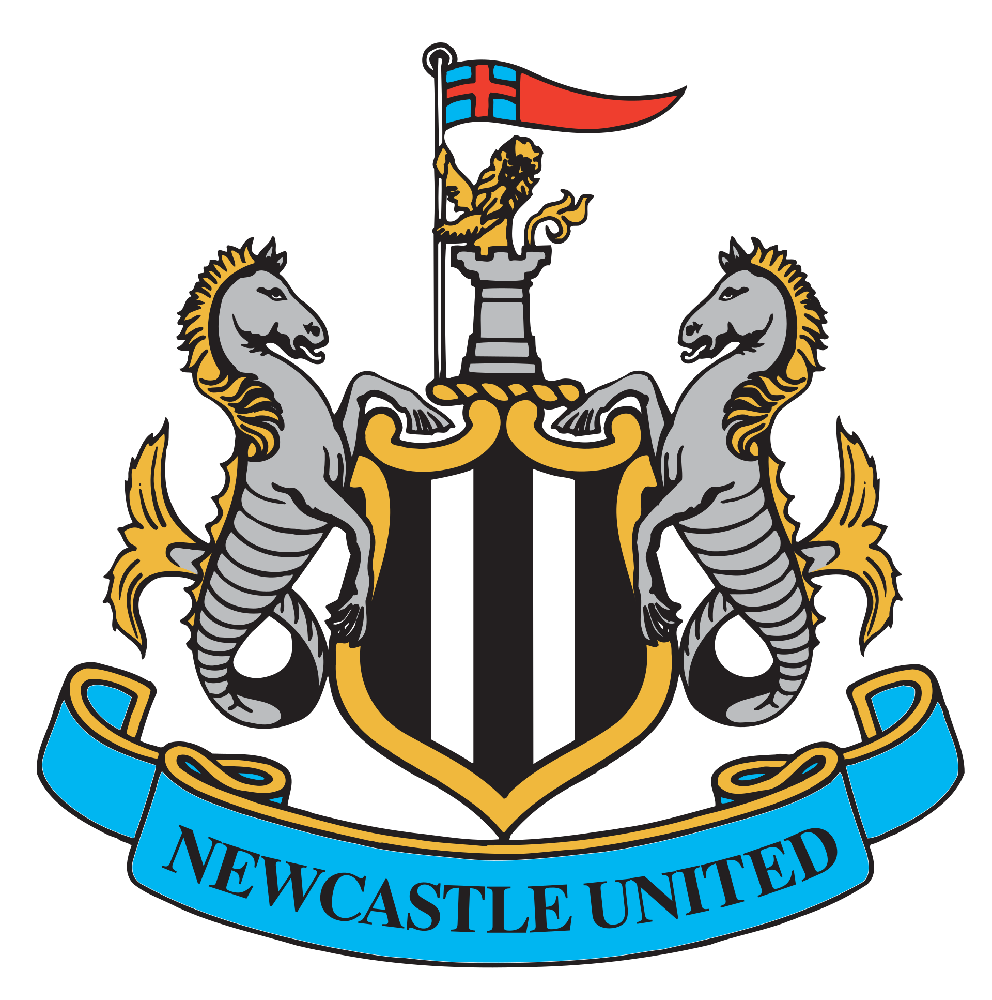
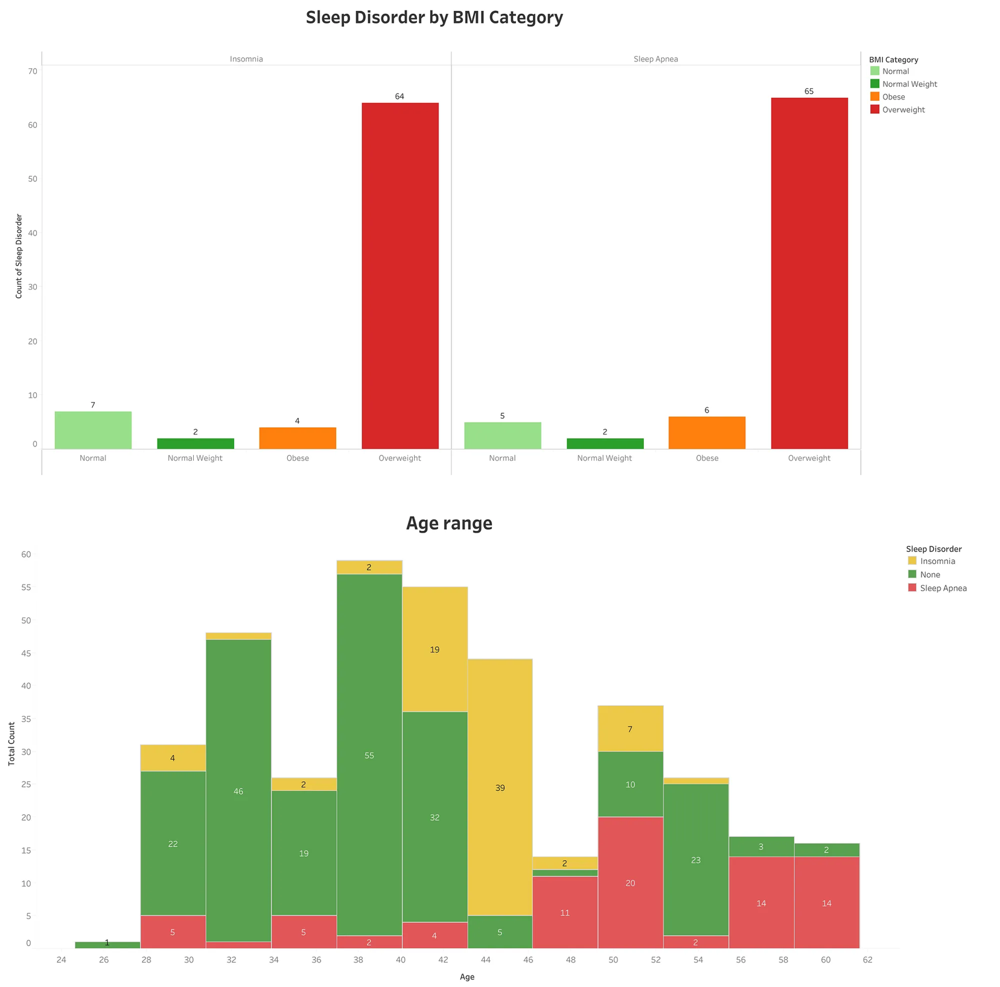

# Portfolio
---
## Data Analysis and Visualization

### Performance Analysis Newcastle United in English Premier League 2021-2022

After 14 years as owner, Ashley sold the club to a new consortium for a reported £305 million, making them the richest football club in the world. The consortium was made up of Saudi Arabia's Public Investment Fund, RB Sports & Media and PCP Capital Partners. Because of that this project obejctives are to analyze Newcastle United's performance in 2021-2022, Identify strengths and weaknesses, Compare between the two managers 

 

---
### Visualize Your Way to Better Sleep: Analyses to Improve Your Quality of Rest

Good quality sleep has a profound impact on our overall health. It strengthens our immune system, boosts cognitive function, improves mood, and enhances memory. Conversely, poor sleep quality can lead to a cascade of negative consequences, including:
 
 
- Increased risk of chronic diseases like heart disease, stroke, and diabetes.
 
- Difficulty concentrating and learning.
 
- Irritability and mood swings.
 
- Decreased energy levels and motivation.
 
 
In this Article, I'm using Sleep Health and Lifestyle Dataset from Kaggle. The Sleep Health and Lifestyle Dataset covering a wide range of variables related to sleep and daily habits. This article use several variables details such as gender, age, sleep duration, quality of sleep, stress levels, BMI category, heart rate, and the presence or absence of sleep disorders.

 

---

## Relational Database Design

### From Books to Bytes: Migrating Your Library to a Digital Database

Design a relational database for a library management system (dummy datasets). The application oversees multiple libraries, each hosting a diverse collection of books with varying quantities available for borrowing. Users can borrow or place holds on books (when the book is not immediately available for borrowing).

 

---

## Machine Learning

### Credit Risk Classification

 

Credit risks are a commonly observed phenomenon in areas of finance that relate to mortgages, credit cards, and other kinds of loans. There is always a probability that the borrower may not get back with the amount. So this project aim is to predict the loan status (default or non-default) based on the given features related to the borrower and the loan itself.

 

 
---

© 2024 Triasto Adhinugroho. Powered by Jekyll and the Minimal Theme.

